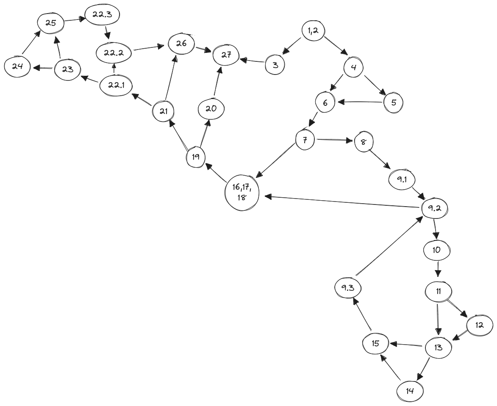

# David Anastasov 216076

## Control Flow Graph


## Цикломатска комплексност
Цикломатската комплексност на кодот е 10, истата ја добив со формулата E-N+2, каде што E е бројот на ребра и N е бројот на јазли.
```
E - N + 2 = 36 - 28 + 2 = 8 + 2 = 10
```

---

## Тест случаеви: Every Branch
- User null  => исполнет е првиот услов **TXX**
- User ("peralta", "DieHard123!", "jake.peralta@nyc.gov") => password има нема празно место и има специјални знаци
- User("boyle", "Nikolaj +", "charles.boyle@nyc.gov") => password има празно место
- User("diaz", "diaz", "rosa.diaz@nyc.gov") => user со ист username и password
- User("holt", "Kevin", "raymondholt@nycgov") => user со лошо форматирана мејл адреса
- User("santiago", "paSSword10!+", "amy.santiago@nyc.gov") => нов user за кој `function` враќа TRUE

## Тест случаеви: Multiple Condition
За условот `if (user==null || user.getPassword()==null || user.getEmail()==null)`
- User null  => исполнет е првиот услов **TXX**
- User("test", null, "test@email.com")  => исполнет е вториот услов  **FTX**
- User("parotz", "crackmeup", null)  => исполнет е третиот услов **FFT**
- User("santiago", "paSSword10!+", "amy.santiago@nyc.gov") => не е исполнет ниту еден од условите **FFF**